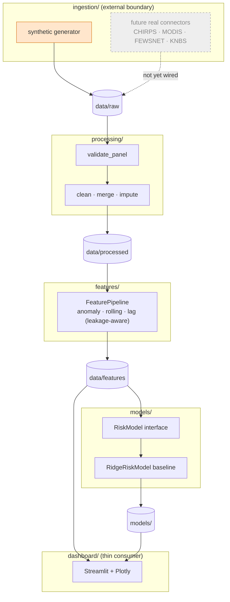

# 🌾 AgriRisk Kenya

> A data-driven **early-warning and decision-support platform** for climate-resilient
> agriculture and food security in Kenya — estimating food-security risk at the
> **county × month** grain by fusing climate, vegetation, agricultural, market and
> socioeconomic signals.

[](https://github.com/kenmambo/agririsk/actions/workflows/ci.yml)
[]()
[]()
[]()

---

## ⚠️ Data status — read this first

**Partially real (M1 in progress).** The `climate` dataset is built from
**real CHIRPS v2.0 satellite-rainfall observations** and `vegetation` from
**real MODIS NDVI/EVI** (see [Real data feeds](#real-data-feeds-m1)); the
remaining datasets (`agriculture`, `market`, `socioeconomic`, `outcome`) are
still **clearly-labelled synthetic sample data**.

- Every observation carries provenance: a `data_source` column per raw dataset
  and per-dataset `{dataset}_source` columns in the merged panel
  (`synthetic`, `chirps`, `modis`, …). The overall status is `mixed` when real
  and synthetic feeds coexist.
- The synthetic generator uses a *documented* causal chain (rainfall → vegetation →
  production → price → risk) so the pipeline and baseline model have genuine signal
  to learn from — **it is scaffolding, not evidence.**
- ⚠️ While the risk *target* is synthetic, model metrics describe how well the
  baseline reproduces **that synthetic target** — even when some features are real.
  No per-county analytical conclusions are valid yet.
- The model card, dashboard banner and code comments all repeat this warning.

### Real data feeds (M1)

| Feed | Dataset | Auth | Enable |
|---|---|---|---|
| **CHIRPS v2.0** monthly rainfall (0.05°, Africa) ✅ live | `climate.precipitation_mm` | none | `python -m agrik --force-raw --source climate=chirps` |
| **MODIS MOD13A1 v6.1** NDVI/EVI (16-day, 500 m) ✅ live | `vegetation.ndvi/evi` | free [NASA Earthdata Login](https://urs.earthdata.nasa.gov) | set `AGRIK_EARTHDATA_TOKEN` (Profile → Applications → *Generate Token*; user/pass Basic auth also supported), then `--source vegetation=modis` |

Details:

```bash
# optional remote-sensing dependencies (also in requirements-m1.txt):
pip install -e ".[rs]"          # rasterio, shapely, pyproj, requests, pyhdf

# live CHIRPS rainfall (downloads ~4 MB/month, cached under data/raw/external/):
python -m agrik --force-raw --source climate=chirps

# live MODIS vegetation (needs Earthdata token; granule volume guard in
# config/pipeline.yaml caps downloads per run, coverage stays honest):
python -m agrik --force-raw --source climate=chirps --source vegetation=modis

# verify your Earthdata credentials before a run (prints no secrets):
python scripts/check_earthdata.py
```

- Counties are approximated by **50 km disks around registry centroids** until real
  boundaries land in M2 — an approximation that is logged everywhere it is used.
- A feed that fails never silently blends in: the run **falls back to the labelled
  synthetic slice with a loud ERROR log**, visible in the `{dataset}_source` column
  (disable via `external.allow_synthetic_fallback: false`).
- `temp_mean_c` is *omitted* (not faked) when the provider has no temperature —
  feature engineering adapts to the columns that exist.

---

## 1. The development problem

Kenya's agriculture is predominantly **smallholder and rain-fed**, and its counties
differ enormously in agro-ecology — from the arid ASAL rangelands of the north-east
to the high-potential central highlands and the Rift Valley breadbasket. Rainfall
failures, land degradation and volatile staple-food prices combine with
**county-level socioeconomic vulnerability** (poverty, limited coping capacity) to
produce food-security crises that are:

- **Spatially uneven** — risk is a *county* story, not a national average.
- **Temporal and lagged** — a poor `MAM` (long-rains) season propagates into
  vegetation, harvest, market prices and finally food consumption **months later**.
- **Multivariate** — no single indicator (rainfall, NDVI, price) is sufficient.

Early-warning systems (e.g. IPC food-security phases) are authoritative but
resource-intensive and released with a lag. There is room for a **transparent,
reproducible, data-driven decision-support layer** that national and county
stakeholders can run and inspect — combining freely-available remote-sensing and
market data with socioeconomic context to produce a comparable risk signal by
county.

**This project builds that platform incrementally**, starting from a rigorous,
well-tested, production-quality architecture rather than a notebook.

### Goals of the MVP

1. County-level **monthly** panel support.
2. A pluggable **data-ingestion** layer.
3. **Validation** + **preprocessing** modules with real quality gates.
4. A **reusable feature-engineering** pipeline (leakage-aware).
5. A **baseline ML model interface** with one concrete model.
6. A simple **Streamlit + Plotly dashboard**.
7. **Unit + integration tests**.
8. **Logging** and **configuration management**.
9. This README.

### Non-goals (for now)

- Production accuracy of risk estimates (data is synthetic).
- Sub-county / parcel geometry, nowcasting, or an operational API.
- Causal inference or policy claims.

---

## 2. Technology stack

| Concern | Choice |
|---|---|
| Language | Python 3.10+ |
| Data wrangling | Pandas, NumPy |
| Geospatial | GeoPandas *(optional `[geo]` extra — see below)* |
| Modelling | Scikit-learn (Ridge baseline) |
| Storage | SQLite / CSV feature store now → PostgreSQL later |
| API *(planned)* | FastAPI (`[api]` extra) |
| UI | Streamlit + Plotly |
| Config | `pydantic-settings` (env/`.env`) + declarative `config/pipeline.yaml` |
| Logging | `logging` `dictConfig` (`config/logging.yaml`) |
| Tests | pytest (+ integration test) |

> **Why GeoPandas is optional:** the MVP runs fully on Windows without compiled
> GDAL wheels. Geospatial work (county boundaries, zonal statistics) is gated behind
> `pip install -e ".[geo]"` and a real boundary layer. The current county map uses
> approximate centroids, not authoritative geometry.

---

## 3. Architecture

The design enforces a **strict separation of concerns**: ingestion, processing,
features, modelling and UI are independent layers that communicate only through
DataFrames conforming to a single **schema contract** and on-disk artefacts.



**Key rule:** the dashboard reads artefacts (`data/features/*`, `models/*`) and
**never** imports ingestion or fitting logic. The only module allowed to touch every
layer is `pipeline.py`, which *orchestrates* order — it contains no domain logic
itself.

### 3.1 Configuration is split in two

| Kind | Mechanism | Contents |
|---|---|---|
| **App config** | `settings.py` (`pydantic-settings`, `AGRIK_` env prefix, `.env`) | environment, log level, directory paths |
| **Pipeline config** | `config/pipeline.yaml` (declarative) | panel definition, dataset registry, validation rules, feature windows, model hyper-parameters |

This means data scientists can change grain, thresholds, windows or the baseline
model **without editing Python**.

### 3.2 Repository layout

```
AgriRisk/
├─ config/
│  ├─ pipeline.yaml          # declarative datasets, validation rules, features, model
│  └─ logging.yaml           # logging dictConfig
├─ data/                     # artefacts (git-ignored; .gitkeep keeps structure)
│  ├─ raw/                   # one CSV per dataset (provenance-marked)
│  ├─ processed/             # cleaned + merged master panel
│  └─ features/              # feature store + manifest
├─ models/                   # baseline_ridge.joblib + model_card.json  (git-ignored)
├─ logs/                     # rotating log files                      (git-ignored)
├─ scripts/
│  └─ smoke_dashboard.py     # headless artefact + chart sanity check
├─ src/agrik/
│  ├─ settings.py            # pydantic-settings config
│  ├─ logging.py             # dictConfig logging + get_logger
│  ├─ counties.py            # county reference registry (subset, documented)
│  ├─ schemas.py             # column contracts, dataset specs, risk bands
│  ├─ pipeline.py            # orchestration (the ONLY module touching all layers)
│  ├─ config/                # YAML loader
│  ├─ ingestion/             # base IO + synthetic generator
│  ├─ processing/            # validation + preprocessing
│  ├─ features/              # feature engineering
│  ├─ models/                # RiskModel interface + Ridge baseline + registry
│  └─ dashboard/             # loaders + Plotly charts + Streamlit app
├─ tests/                    # pytest unit + integration tests
├─ pyproject.toml            # packaging, deps, pytest & ruff config
└─ README.md
```

---

## 4. The data model

**Grain:** one row per **county per month**. All datasets share this contract so
they can be validated independently and outer-joined into a master panel without
information loss.

| Group | Columns |
|---|---|
| Keys | `county_code`, `year`, `month`, `date`, `county_name` |
| Climate | `precipitation_mm`, `temp_mean_c` |
| Vegetation | `ndvi`, `evi` |
| Agriculture | `prod_index` |
| Market | `maize_price_kes_kg` |
| Socioeconomic | `rural_pop`, `poverty_rate`, `coping_capacity_index` |
| Outcome (target) | `food_security_risk_index` (0–100), `ipc_crisis_households` |
| Provenance | `data_source` |

**County registry** ([`src/agrik/counties.py`](src/agrik/counties.py)) ships a
*documented subset* — official codes **001–021** covering Kenya's main agro-ecological
zones — with **approximate centroids** for simple mapping. Codes **022–047** and a real
boundary layer are to be added with the authoritative source (KNBS). This is honest
reference data, not a complete 47-county gazetteer.

### Feature engineering (leakage-aware)

From raw drivers, per county, using only **current or past** information:

- `*_anom` — rolling z-score anomaly (SPI-like) of rainfall / temperature / NDVI / EVI / price
- `*_roll3`, `*_roll6` — rolling means
- `*_lag1`, `*_lag3` — temporal lags (crisis signals propagate with delay)
- `price_pct3` — 3-month percentage price change
- `month_sin`, `month_cos` — cyclical seasonality encoding

A dedicated unit test asserts that **changing a future value never alters past
features** — the leakage guarantee is enforced, not assumed.

---

## 5. Modelling

A stable interface, [`RiskModel`](src/agrik/models/base.py)
(`fit` / `predict` / `evaluate` / `save` / `load` + a `ModelCard`), lets the
pipeline and UI stay algorithm-agnostic.

- **Baseline:** `RidgeRiskModel` — `StandardScaler → Ridge` in a scikit-learn
  `Pipeline`, selected via `config/pipeline.yaml` and a small registry.
- **Honest evaluation:** a **temporal** train/test split (train on earlier months,
  test on later months) mirrors the real forecasting task and avoids shuffle leakage.
- Metrics (`RMSE`, `MAE`, `R²`), row counts and the synthetic data note are persisted
  to `models/model_card.json`.

> The baseline's reported accuracy describes how well it reproduces the
> **synthetic** generative process. It carries **no real-world meaning** until real
> data is integrated.

---

## 6. Getting started

### Prerequisites
Python 3.10+. A virtual environment is recommended (a [`uv`](https://docs.astral.sh/uv/)
quickstart is shown; `venv`+`pip` works identically).

```bash
# create + activate a venv
uv venv .venv --python 3.13 && source .venv/bin/activate    # (or: python -m venv .venv)

# install the package + dependencies (editable)
pip install -e .                       # runtime deps
pip install -r requirements-dev.txt    # + pytest, ruff

# (optional) geospatial & API extras
# pip install -e ".[geo]"   # geopandas/shapely  (needs GDAL wheels)
# pip install -e ".[api]"   # fastapi/uvicorn
```

### 1 · Build the data + baseline model

```bash
python -m agrik                 # or: agrik-build-data
python -m agrik --force-raw     # regenerate synthetic raw data
```

This runs: **ingestion → validation → preprocessing → features → training**, writing
`data/raw`, `data/processed`, `data/features` and `models/*`, with structured logs to
`logs/agrik.log`.

### 2 · Launch the dashboard

```bash
streamlit run src/agrik/dashboard/app.py
```

Map of county risk, time-series trends, a baseline **model card**, standardised
coefficients, and a provenance-aware data table — all guarded by a prominent
**SYNTHETIC DATA** banner.

### 3 · Run tests & sanity checks

```bash
pytest -q                       # 43 unit + integration tests (offline, no network)
python scripts/smoke_dashboard.py   # artefacts load + all Plotly figures build
```

---

## 7. Configuration reference

- **Environment / paths** — copy `.env.example` → `.env`; override any field with the
  `AGRIK_` prefix (e.g. `AGRIK_DATA_ROOT`, `AGRIK_LOG_LEVEL`).
- **`config/pipeline.yaml`** — the single source of truth for:
  - `panel` — grain, year range, key columns
  - `datasets` — registry of datasets + their provenance `source`
  - `validation` — required columns, value ranges, year/month bounds
  - `feature_engineering` — z-score window, rolling windows, lag periods
  - `model` — target, test size, baseline type & hyper-parameters
- **`config/logging.yaml`** — console + rotating-file logging.

---

## 8. Roadmap

| Milestone | Work |
|---|---|
| **M1 · Real data (climate & veg)** | 🚧 In progress: **CHIRPS rainfall connector done & live**; **MODIS NDVI/EVI connector done & live** (Earthdata token, volume-guarded granule sampling); ERA5/Open-Meteo temperature; county boundary GeoPackage (`[geo]` extra) replaces centroid disks |
| **M2 · Markets & stats** | FEWSNET/KMD maize prices; KNBS production & socioeconomic; backfill full 001–047 registry |
| **M3 · Modelling** | Gradient-boosting baseline, calibration, uncertainty, forecasting horizon; compare against Ridge via the shared interface |
| **M4 · Serving** | FastAPI service (`[api]`) exposing the risk panel + model card; scheduled pipeline runs |
| **M5 · Platform** | PostgreSQL + PostGIS, Airflow/Prefect orchestration, data-quality dashboards, alerting |

### How to add a real data source
1. Write a connector in `src/agrik/ingestion/` that returns a DataFrame conforming to
   [`schemas.py`](src/agrik/schemas.py) and raises `ExternalDataError` on failure.
2. Register it in `providers._REGISTRY` (or `register_provider(...)`) and set
   `source: <provider>` in `config/pipeline.yaml` — or pass `--source <dataset>=<provider>`
   for a single run without touching the file.
3. Nothing downstream changes — validation, features, model and UI already depend on
   the schema plus the `{dataset}_source` provenance columns.

---

## 9. Engineering principles

- **Layered separation** — ingestion ≠ processing ≠ features ≠ models ≠ UI.
- **Schema as contract** — layers exchange typed DataFrames, verified by validation.
- **Configuration-driven** — behaviour lives in YAML/env, not code.
- **Honesty about data** — provenance columns, a synthetic banner, and a model card
  note; **no fabricated analytical conclusions**.
- **Leakage-aware by construction** — per-county, past-only features + temporal splits,
  enforced by tests.
- **Tested** — pure functions per layer, plus an end-to-end integration test that
  writes only to a temp directory.

---

## License

MIT — see [LICENSE](LICENSE).

---

*AgriRisk Kenya is an incremental portfolio project. The current build is an
architecture and workflow validated on synthetic sample data, ready to be plugged
into real climate, vegetation, market and socioeconomic feeds.*
