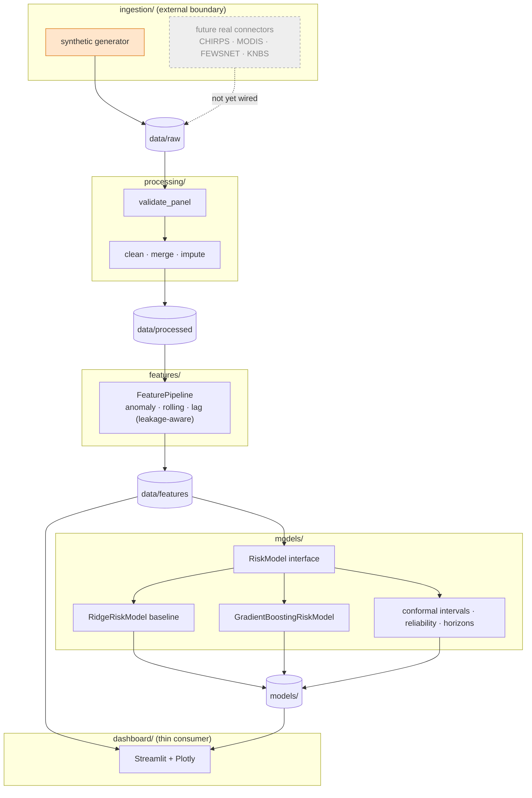

# 🌾 AgriRisk Kenya

> A data-driven **early-warning and decision-support platform** for climate-resilient
> agriculture and food security in Kenya — estimating food-security risk at the
> **county × month** grain by fusing climate, vegetation, agricultural, market and
> socioeconomic signals.

[](https://github.com/kenmambo/agririsk/actions/workflows/ci.yml)
[]()
[]()
[]()

**🚀 Live (free Render tier — first visit may take ~60 s to spin up):**
dashboard · <https://agrik-dashboard.onrender.com> — API docs ·
<https://agrik-api.onrender.com/docs> — alerts ·
<https://agrik-api.onrender.com/alerts?date=2022-12>
(serving the committed real-feed artefact bundle, provenance intact).

---

## ⚠️ Data status — read this first

**All six datasets run on real feeds (M2 + ERA5 temperature).** `climate` =
CHIRPS v2.0 rainfall + ERA5 temperature (Open-Meteo), `vegetation` = MODIS
NDVI/EVI, `market` = FEWS NET county maize retail prices,
`outcome` = FEWS NET county IPC phases, `socioeconomic` = HDX county MPI
headcount (KDHS 2022) + WorldPop rural population, `agriculture` = World Bank
national food production index (see [Real data feeds](#real-data-feeds)).
Honest limitations that remain:

- the risk *target* is a **documented derivation** of IPC phases
  (`risk = (phase − 1) × 25`, worst zone per county-month), not a continuous
  published index;
- `agriculture` is **national-annual** data broadcast to county-months — no
  free county×month crop-production series exists for Kenya;
- county gaps stay **absent, never faked** (e.g. districts FEWS NET does not
  analyse, price-free months); imputation fills them and is logged.

- Every observation carries provenance: a `data_source` column per raw dataset
  and per-dataset `{dataset}_source` columns in the merged panel
  (`synthetic`, `chirps`, `modis`, `fewsnet_prices`, …). The overall status is
  `mixed` when real and synthetic feeds coexist.
- The synthetic generator remains the offline default (and CI fixture) — a
  fresh clone or `source: synthetic` config still produces labelled sample
  data, and the dashboard banner reports which state the loaded panel is in.
- The synthetic generator uses a *documented* causal chain (rainfall → vegetation →
  production → price → risk) so the pipeline and baseline model have genuine signal
  to learn from — **it is scaffolding, not evidence.**
- ⚠️ With the real IPC-derived target, model metrics describe fit on **observed**
  food-security phases — but the target's stepwise {0,25,50,75,100} structure and
  the national-grain agriculture feed cap how far per-county conclusions can be
  pushed.
- **M3 modelling results** (identical chronological split, real target, 36
  features): gradient boosting RMSE **13.25** / R² **0.64** vs the Ridge floor
  RMSE 17.67 / R² 0.35; conformal 90% intervals are reported as *indicative*
  (empirical coverage ~0.66–0.71 — the calibration window under-represents
  drift in the test window, which is exactly what the uncertainty disclosure is
  for); forecast skill decays honestly with lead time (1-month-ahead R² 0.37 →
  3-month-ahead R² 0.29). See `models/comparison.json` and the model tab.
- The model card, dashboard banner and code comments all repeat this warning.
- **M4 serving:** the FastAPI service (`agrik-serve`) and the scheduled-run
  script expose/refresh exactly these artefacts - every data response echoes
  its provenance (`data_is_synthetic`, `dataset_sources`) and a missing
  artefact is a 503 with a hint, never a fabricated number (see
  [Serve the API](#3--serve-the-api-m4)).
- **M5 containers:** the Docker image ships only the serving artefacts
  (`deploy/seed/`, ~1.7 MB, committed to the repo) - so the deployed
  container shows the *same* real-feed panels as the local run, with the same
  provenance flags. No secrets, no 19 GB granule cache, and no silent
  re-ingestion ever enter the image (see
  [Containerise & deploy](#4--containerise--deploy-m5)).

### Real data feeds

| Feed | Dataset | Auth | Enable |
|---|---|---|---|
| **CHIRPS v2.0** monthly rainfall (0.05°, Africa) ✅ live | `climate.precipitation_mm` | none | `python -m agrik --force-raw --source climate=chirps` |
| **MODIS MOD13A1 v6.1** NDVI/EVI (16-day, 500 m) ✅ live | `vegetation.ndvi/evi` | free [NASA Earthdata Login](https://urs.earthdata.nasa.gov) | set `AGRIK_EARTHDATA_TOKEN` (Profile → Applications → *Generate Token*; user/pass Basic auth also supported), then `--source vegetation=modis` |
| **Open-Meteo ERA5** daily 2 m temperature → monthly mean ✅ live | `climate.temp_mean_c` | none | `--set external.openmeteo.enabled=true` (joins into the climate frame; rows become `chirps+openmeteo`) |
| **FEWS NET** county maize retail prices (KES/kg) ✅ live | `market.maize_price_kes_kg` | none | `--source market=fewsnet_prices` |
| **FEWS NET** county IPC phases → risk target ✅ live | `outcome.food_security_risk_index` | none | `--source outcome=fewsnet_ipc` |
| **HDX** county MPI headcount + WorldPop rural pop ✅ live | `socioeconomic.poverty_rate/rural_pop` | none | `--source socioeconomic=hdx_knbs` |
| **World Bank** national food production index ✅ live | `agriculture.prod_index` | none | `--source agriculture=wb_foodindex` |

Details:

```bash
# optional remote-sensing dependencies (also in requirements-m1.txt):
pip install -e ".[rs]"          # rasterio, shapely, pyproj, requests, pyhdf

# live CHIRPS rainfall (downloads ~4 MB/month, cached under data/raw/external/):
python -m agrik --force-raw --source climate=chirps

# live MODIS vegetation (needs Earthdata token; granule volume guard in
# config/pipeline.yaml caps downloads per run, coverage stays honest):
python -m agrik --force-raw --source climate=chirps --source vegetation=modis

# the full real-feed pipeline (M2: FEWS NET prices + IPC, HDX socioeconomic,
# World Bank agriculture - all no-auth CSV/JSON APIs, cached after first run;
# plus the Open-Meteo ERA5 temperature enrichment):
python -m agrik --force-raw --set external.openmeteo.enabled=true \
  --source climate=chirps --source vegetation=modis \
  --source market=fewsnet_prices --source outcome=fewsnet_ipc \
  --source socioeconomic=hdx_knbs --source agriculture=wb_foodindex

# verify your Earthdata credentials before a run (prints no secrets):
python scripts/check_earthdata.py
```

- Counties are approximated by **50 km disks around registry centroids** until real
  boundaries land in M2 — an approximation that is logged everywhere it is used.
- A feed that fails never silently blends in: the run **falls back to the labelled
  synthetic slice with a loud ERROR log**, visible in the `{dataset}_source` column
  (disable via `external.allow_synthetic_fallback: false`).
- `temp_mean_c` is *omitted* (not faked) when a provider has no temperature
  and the Open-Meteo enrichment is off (e.g. offline/synthetic runs) —
  feature engineering adapts to the columns that exist.

---

## 1. The development problem

Kenya's agriculture is predominantly **smallholder and rain-fed**, and its counties
differ enormously in agro-ecology — from the arid ASAL rangelands of the north-east
to the high-potential central highlands and the Rift Valley breadbasket. Rainfall
failures, land degradation and volatile staple-food prices combine with
**county-level socioeconomic vulnerability** (poverty, limited coping capacity) to
produce food-security crises that are:

- **Spatially uneven** — risk is a *county* story, not a national average.
- **Temporal and lagged** — a poor `MAM` (long-rains) season propagates into
  vegetation, harvest, market prices and finally food consumption **months later**.
- **Multivariate** — no single indicator (rainfall, NDVI, price) is sufficient.

Early-warning systems (e.g. IPC food-security phases) are authoritative but
resource-intensive and released with a lag. There is room for a **transparent,
reproducible, data-driven decision-support layer** that national and county
stakeholders can run and inspect — combining freely-available remote-sensing and
market data with socioeconomic context to produce a comparable risk signal by
county.

**This project builds that platform incrementally**, starting from a rigorous,
well-tested, production-quality architecture rather than a notebook.

### Goals of the MVP

1. County-level **monthly** panel support.
2. A pluggable **data-ingestion** layer.
3. **Validation** + **preprocessing** modules with real quality gates.
4. A **reusable feature-engineering** pipeline (leakage-aware).
5. A **baseline ML model interface** with one concrete model.
6. A simple **Streamlit + Plotly dashboard**.
7. **Unit + integration tests**.
8. **Logging** and **configuration management**.
9. This README.

### Non-goals (for now)

- Production accuracy of risk estimates (feeds are real; M3 established the
  comparison + uncertainty baseline — operational accuracy needs county-grain
  production data and a longer history).
- Sub-county / parcel geometry, nowcasting, or an operational API.
- Causal inference or policy claims.

---

## 2. Technology stack

| Concern | Choice |
|---|---|
| Language | Python 3.10+ |
| Data wrangling | Pandas, NumPy |
| Geospatial | GeoPandas *(optional `[geo]` extra — see below)* |
| Modelling | Scikit-learn (Ridge baseline + HistGradientBoosting, conformal uncertainty) |
| Storage | SQLite / CSV feature store now → PostgreSQL later |
| API | **FastAPI + uvicorn** (`[api]` extra) — live read-only service (M4) |
| UI | Streamlit + Plotly |
| Config | `pydantic-settings` (env/`.env`) + declarative `config/pipeline.yaml` |
| Logging | `logging` `dictConfig` (`config/logging.yaml`) |
| Tests | pytest (+ integration test) |

> **Why GeoPandas is optional:** the MVP runs fully on Windows without compiled
> GDAL wheels. Geospatial work (county boundaries, zonal statistics) is gated behind
> `pip install -e ".[geo]"` and a real boundary layer. The current county map uses
> approximate centroids, not authoritative geometry.

---

## 3. Architecture

The design enforces a **strict separation of concerns**: ingestion, processing,
features, modelling and UI are independent layers that communicate only through
DataFrames conforming to a single **schema contract** and on-disk artefacts.


```mermaid
flowchart TD
    subgraph Ingestion["ingestion/  (external boundary)"]
      SYN["synthetic generator"]:::syn
      REAL["future real connectors\nCHIRPS · MODIS · FEWSNET · KNBS"]:::todo
    end
    RAW[(data/raw)]
    subgraph Processing["processing/"]
      VAL["validate_panel"]
      PRE["clean · merge · impute"]
    end
    PROC[(data/processed)]
    subgraph Features["features/"]
      FE["FeaturePipeline\nanomaly · rolling · lag (leakage-aware)"]
    end
    STORE[(data/features)]
    subgraph Models["models/"]
      BASE["RiskModel interface"]
      RIDGE["RidgeRiskModel baseline"]
      GBM["GradientBoostingRiskModel"]
      UNC["conformal intervals · reliability · horizons"]
    end
    ART[(models/)]
    subgraph UI["dashboard/  (thin consumer)"]
      APP["Streamlit + Plotly"]
    end

    SYN --> RAW
    REAL -.not yet wired.-> RAW
    RAW --> VAL --> PRE --> PROC
    PROC --> FE --> STORE
    STORE --> BASE --> RIDGE --> ART
    BASE --> GBM --> ART
    BASE --> UNC --> ART
    STORE --> APP
    ART --> APP
    classDef syn fill:#ffe6cc,stroke:#d9730d;
    classDef todo fill:#eee,stroke:#999,stroke-dasharray:4 4,color:#888;
```

**Key rule:** the dashboard reads artefacts (`data/features/*`, `models/*`) and
**never** imports ingestion or fitting logic. The only module allowed to touch every
layer is `pipeline.py`, which *orchestrates* order — it contains no domain logic
itself.

### 3.1 Configuration is split in two

| Kind | Mechanism | Contents |
|---|---|---|
| **App config** | `settings.py` (`pydantic-settings`, `AGRIK_` env prefix, `.env`) | environment, log level, directory paths |
| **Pipeline config** | `config/pipeline.yaml` (declarative) | panel definition, dataset registry, validation rules, feature windows, model hyper-parameters |

This means data scientists can change grain, thresholds, windows or the baseline
model **without editing Python**.

### 3.2 Repository layout

```
AgriRisk/
├─ config/
│  ├─ pipeline.yaml          # declarative datasets, validation rules, features, model
│  └─ logging.yaml           # logging dictConfig
├─ data/                     # artefacts (git-ignored; .gitkeep keeps structure)
│  ├─ raw/                   # one CSV per dataset (provenance-marked)
│  ├─ processed/             # cleaned + merged master panel
│  └─ features/              # feature store + manifest
├─ models/                   # baseline_ridge.joblib + model_card.json  (git-ignored)
├─ logs/                     # rotating log files                      (git-ignored)
├─ scripts/
│  ├─ smoke_dashboard.py     # headless artefact + chart sanity check
│  ├─ schedule_pipeline.ps1  # Windows Task Scheduler registration (M4)
│  └─ export_deploy_bundle.py # serving-only artefact bundle (M5)
├─ deploy/
│  └─ seed/                  # committed bundle the Docker image serves from (~1.7 MB)
├─ src/agrik/
│  ├─ settings.py            # pydantic-settings config
│  ├─ logging.py             # dictConfig logging + get_logger
│  ├─ counties.py            # county reference registry (subset, documented)
│  ├─ schemas.py             # column contracts, dataset specs, risk bands
│  ├─ pipeline.py            # orchestration (the ONLY module touching all layers)
│  ├─ config/                # YAML loader
│  ├─ ingestion/             # base IO + synthetic generator
│  ├─ processing/            # validation + preprocessing
│  ├─ features/              # feature engineering
│  ├─ models/                # RiskModel interface + Ridge/GBM + registry
│  ├─ api/                   # FastAPI serving layer (read-only over artefacts)
│  └─ dashboard/             # loaders + Plotly charts + Streamlit app
├─ tests/                    # pytest unit + integration tests
├─ Dockerfile                # serving image (API + dashboard) over deploy/seed
├─ docker-compose.yml        # api :8000 + dashboard :8502, healthchecked
├─ requirements-docker.txt   # image deps (cached layer, mirrors pyproject + [api])
├─ pyproject.toml            # packaging, deps, pytest & ruff config
└─ README.md
```

---

## 4. The data model

**Grain:** one row per **county per month**. All datasets share this contract so
they can be validated independently and outer-joined into a master panel without
information loss.

| Group | Columns |
|---|---|
| Keys | `county_code`, `year`, `month`, `date`, `county_name` |
| Climate | `precipitation_mm`, `temp_mean_c` |
| Vegetation | `ndvi`, `evi` |
| Agriculture | `prod_index` |
| Market | `maize_price_kes_kg` |
| Socioeconomic | `rural_pop`, `poverty_rate`, `coping_capacity_index` |
| Outcome (target) | `food_security_risk_index` (0–100), `ipc_crisis_households` |
| Provenance | `data_source` |

**County registry** ([`src/agrik/counties.py`](src/agrik/counties.py)) ships a
*documented subset* — official codes **001–021** covering Kenya's main agro-ecological
zones — with **approximate centroids** for simple mapping. Codes **022–047** and a real
boundary layer are to be added with the authoritative source (KNBS). This is honest
reference data, not a complete 47-county gazetteer.

### Feature engineering (leakage-aware)

From raw drivers, per county, using only **current or past** information:

- `*_anom` — rolling z-score anomaly (SPI-like) of rainfall / temperature / NDVI / EVI / price
- `*_roll3`, `*_roll6` — rolling means
- `*_lag1`, `*_lag3` — temporal lags (crisis signals propagate with delay)
- `price_pct3` — 3-month percentage price change
- `month_sin`, `month_cos` — cyclical seasonality encoding

A dedicated unit test asserts that **changing a future value never alters past
features** — the leakage guarantee is enforced, not assumed.

---

## 5. Modelling

A stable interface, [`RiskModel`](src/agrik/models/base.py)
(`fit` / `predict` / `evaluate` / `save` / `load` + a `ModelCard`), lets the
pipeline and UI stay algorithm-agnostic.

- **Baseline floor:** `RidgeRiskModel` — `StandardScaler → Ridge`.
- **Gradient boosting:** `GradientBoostingRiskModel` — sklearn's
  `HistGradientBoostingRegressor` (saturating non-linearities; NaN-robust, so
  genuinely absent months stay absent). Both share the interface and are
  selected/hyper-parameterised entirely in `config/pipeline.yaml`.
- **Honest evaluation:** a **chronological three-way split** (train →
  calibration → test, no shuffling) mirrors the real forecasting task; every
  model in `model.compare` is re-fitted on the identical train block and
  reported side-by-side in `models/comparison.json`.
- **Uncertainty (calibration):** split-**conformal** prediction intervals
  (`models/uncertainty.py`) calibrated on the held-out calibration block —
  coverage (PICP) and width (PINAW) are reported, and the model card states
  plainly that exchangeability is only approximate under temporal drift, so
  coverage is indicative, not a guarantee. A regression **reliability table**
  (mean predicted vs mean observed per prediction bin) quantifies calibration
  error in target units.
- **Forecast horizon:** `models/horizon.py` re-labels targets `h` months ahead
  *within each county* (leakage-safe) and re-fits per lead time, so
  early-warning skill decay (`model.horizons: [1, 3]`) is measured honestly —
  `n_test` shrinks with the horizon because the last months have no future
  target yet.
- Artefacts: `model_card.json` (metrics + intervals + reliability + horizon +
  comparison + provenance note), `comparison.json`, `test_predictions.csv`
  (held-out predictions with interval band, rendered by the dashboard model
  tab).

> Metrics on the real IPC-derived target describe **observed** phases; the
> stepwise target and national-grain agriculture feed cap interpretability, as
> the model card states.

---

## 6. Getting started

### Prerequisites
Python 3.10+. A virtual environment is recommended (a [`uv`](https://docs.astral.sh/uv/)
quickstart is shown; `venv`+`pip` works identically).

```bash
# create + activate a venv
uv venv .venv --python 3.13 && source .venv/bin/activate    # (or: python -m venv .venv)

# install the package + dependencies (editable)
pip install -e .                       # runtime deps
pip install -r requirements-dev.txt    # + pytest, ruff

# (optional) geospatial & API extras
# pip install -e ".[geo]"   # geopandas/shapely  (needs GDAL wheels)
# pip install -e ".[api]"   # fastapi/uvicorn
```

### 1 · Build the data + baseline model

```bash
python -m agrik                 # or: agrik-build-data
python -m agrik --force-raw     # regenerate synthetic raw data
```

This runs: **ingestion → validation → preprocessing → features → training**, writing
`data/raw`, `data/processed`, `data/features` and `models/*`, with structured logs to
`logs/agrik.log`.

### 2 · Launch the dashboard

```bash
streamlit run src/agrik/dashboard/app.py
```

Map of county risk, time-series trends, a baseline **model card**, standardised
coefficients, and a provenance-aware data table — all guarded by a prominent
**SYNTHETIC DATA** banner.

### 3 · Serve the API (M4)

```bash
pip install -e ".[api]"
agrik-serve                # or: python -m agrik.api  (127.0.0.1:8000 by default)
```

Interactive docs at `http://127.0.0.1:8000/docs`. The service is a **read-only
view over the artefacts** `python -m agrik` wrote (same decoupling rule as the
dashboard - it never ingests or fits), and every data response carries
provenance (`data_is_synthetic`, `dataset_sources`).

| Endpoint | Purpose |
|---|---|
| `GET /health` | artefact presence + pipeline version |
| `GET /data/status` | rows/counties/period + per-dataset provenance |
| `GET /panel` | county-month rows; filters `county_code`, `year_from/to`, `agro_zone`, `limit/offset`, `all_columns` |
| `GET /risk/summary` | per-county risk + display band for a month (`?date=YYYY-MM`, default latest) |
| `GET /alerts` | early warning: counties whose risk escalated vs a trailing baseline window (`date`, `baseline_months`, `min_delta`, `county_code`) |
| `GET /counties` | county registry reference (codes, centroids, zones) |
| `GET /model/card` · `/model/comparison` | M3 metrics, uncertainty, horizons |
| `GET /model/predictions` | held-out predictions with conformal intervals |

Missing artefacts return a **503 with a "run `python -m agrik` first" hint** -
the API never fabricates. Bind address/port via `AGRIK_API_HOST` /
`AGRIK_API_PORT` (loopback by default; widen only behind a reverse proxy).
Browsers hitting `/` get a human-readable landing page (endpoint list + live
provenance badge); API clients keep receiving JSON (content negotiation on
the `Accept` header).

**Scheduled pipeline runs:** `pwsh scripts/schedule_pipeline.ps1` registers a
Windows daily task (default 06:00, `StartWhenAvailable`; `-AtHour`, `-Remove`,
`-WhatIf` supported); the cron equivalent is
`0 6 * * * cd /path/AgriRisk && .venv/bin/python -m agrik`.

### 4 · Containerise & deploy (M5)

The serving layer is read-only, so a deployment needs only the artefacts -
not credentials, not the 19 GB granule cache. The current real-feed bundle is
committed under `deploy/seed/`, so a plain clone can build and run:

```bash
docker compose up --build     # API :8000 + dashboard :8502, both healthchecked
```

To refresh the data the container serves (after re-running the pipeline on the
host, where the Earthdata cache lives):

```bash
python -m agrik                          # rebuild artefacts from real feeds
python scripts/export_deploy_bundle.py   # rewrite deploy/seed/ (~1.7 MB)
```

The export script refuses to run without artefacts, prints the provenance it
bundled, and warns loudly if anything is synthetic - the honest-labelling rule
survives the container boundary. The image runs as a non-root user, installs
its dependencies from `requirements-docker.txt` as a cached layer before the
code copy (fast incremental rebuilds), and excludes `.env`/`data/`/`models/`
via `.dockerignore`. Cloud hosts (Render/Railway/Fly.io) can build straight
from the repo: Dockerfile, default role API on `$PORT` via `AGRIK_API_PORT`; the
dashboard needs the Streamlit command override from `docker-compose.yml`.

> Container-equivalence is verified offline in `tests/test_deploy_bundle.py`:
> the API serves *from the bundle alone*, with matching model-card metrics and
> the synthetic flag intact. The image has also been built and run locally
> (Docker Desktop, WSL2 backend): both containers report healthy and serve
> the real-feed bundle end to end.

### 5 · Publish on the cloud (free tier)

`render.yaml` is a one-click blueprint for [render.com](https://render.com)
(no credit card for free instances):

1. Push this repo to GitHub (done).
2. On `dashboard.render.com` → **New → Blueprint** → connect
   `kenmambo/agririsk` — Render reads `render.yaml` and offers both free
   Docker services (`agrik-api`, `agrik-dashboard`). Approve.
3. First deploy takes ~5-8 min (Docker build). Then open
   `https://agrik-api.onrender.com` (landing page) and
   `https://agrik-dashboard.onrender.com`.

The services honor Render's injected `PORT` (see
`agrik.api.__main__.resolve_port`), health-check `/health` and
`/_stcore/health`, and serve the committed artefact bundle - credentials and
raw feeds never leave your machine. Honest free-tier caveats: instances spin
down after ~15 idle minutes (~60 s cold start on the next request), and
free bandwidth is ~5 GB/month. Fly.io/Railway work with the same Dockerfile
but require a payment method; skip them unless you outgrow Render's free plan.

### 6 · Run tests & sanity checks

```bash
pytest -q                       # 108 unit + integration tests (offline, no network)
python scripts/smoke_dashboard.py   # artefacts load + all Plotly figures build
```

---

## 7. Configuration reference

- **Environment / paths** — copy `.env.example` → `.env`; override any field with the
  `AGRIK_` prefix (e.g. `AGRIK_DATA_ROOT`, `AGRIK_LOG_LEVEL`).
- **`config/pipeline.yaml`** — the single source of truth for:
  - `panel` — grain, year range, key columns
  - `datasets` — registry of datasets + their provenance `source`
  - `validation` — required columns, value ranges, year/month bounds
  - `feature_engineering` — z-score window, rolling windows, lag periods
  - `model` — target, test size, baseline type & hyper-parameters
- **`config/logging.yaml`** — console + rotating-file logging.

---

## 8. Roadmap

| Milestone | Work |
|---|---|
| **M1 · Real data (climate & veg)** | ✅ Done: **CHIRPS rainfall live**; **MODIS NDVI/EVI live** (Earthdata token, full-window granule coverage); **ERA5 temperature via Open-Meteo live**; remaining: county boundary GeoPackage (`[geo]` extra) to replace centroid disks |
| **M2 · Markets & stats** | ✅ Done: **FEWS NET maize prices + IPC outcome live**; **HDX poverty/rural-pop socioeconomic live**; **World Bank food-index agriculture live** (national grain); remaining: county-grain production feed, `ipc_crisis_households`, backfill full 001–047 registry |
| **M3 · Modelling** | ✅ Done: **GBM vs Ridge on the identical chronological split** (R² 0.64 vs 0.35 on the real IPC target); **conformal uncertainty intervals + coverage reporting**; **regression reliability/calibration table**; **1- and 3-month forecast-horizon evaluation**; remaining: probability calibration for IPC-phase classification, spatial (county-adjacency) features |
| **M4 · Serving** | ✅ Done: **FastAPI service** (`[api]` extra) exposing the risk panel + provenance + M3 model artefacts; **scheduled pipeline runs** (Windows task script / cron one-liner); remaining: auth + rate limiting for public deployment |
| **M5 · Platform** | ✅ Partial: **Docker image + compose** (API + dashboard, non-root, healthchecked) serving the committed `deploy/seed` artefact bundle; **`/alerts` early-warning endpoint** (band-escalation vs trailing baseline, live-verified: Marsabit Crisis→Above Crisis at 2022-12); remaining: PostgreSQL + PostGIS, Airflow/Prefect orchestration, data-quality dashboards |

### How to add a real data source
1. Write a connector in `src/agrik/ingestion/` that returns a DataFrame conforming to
   [`schemas.py`](src/agrik/schemas.py) and raises `ExternalDataError` on failure.
2. Register it in `providers._REGISTRY` (or `register_provider(...)`) and set
   `source: <provider>` in `config/pipeline.yaml` — or pass `--source <dataset>=<provider>`
   for a single run without touching the file.
3. Nothing downstream changes — validation, features, model and UI already depend on
   the schema plus the `{dataset}_source` provenance columns.

---

## 9. Engineering principles

- **Layered separation** — ingestion ≠ processing ≠ features ≠ models ≠ UI.
- **Schema as contract** — layers exchange typed DataFrames, verified by validation.
- **Configuration-driven** — behaviour lives in YAML/env, not code.
- **Honesty about data** — provenance columns, a synthetic banner, and a model card
  note; **no fabricated analytical conclusions**.
- **Leakage-aware by construction** — per-county, past-only features + temporal splits,
  enforced by tests.
- **Tested** — pure functions per layer, plus an end-to-end integration test that
  writes only to a temp directory.

---

## License

MIT — see [LICENSE](LICENSE).

---

*AgriRisk Kenya is an incremental portfolio project. The current build runs the
full pipeline on live observed feeds with a leakage-aware feature store and a
compared, uncertainty-disclosed modelling layer - ready for serving (M4) and
broader county coverage.*
